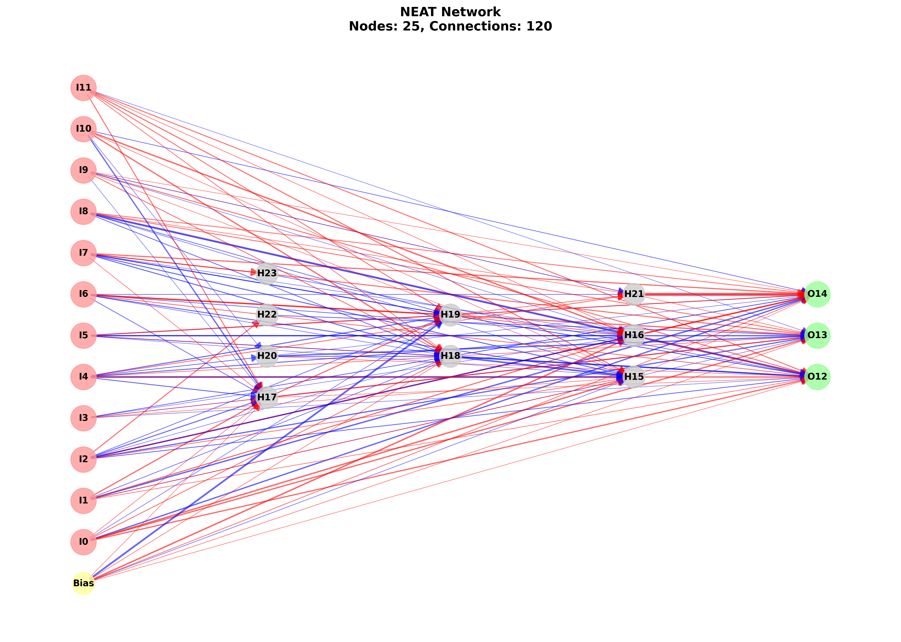

# NEAT (NeuroEvolution of Augmenting Topologies) Implementation for Slime Volleyball

This directory contains a complete implementation of the NEAT algorithm from first principles, designed to evolve neural networks for playing Neural Slime Volleyball.

## Results Showcase

### 🆚 Results Against Baseline After 40 Generations


> **Note:** The results against the baseline (David Ha's RNN agent) are quite poor. This may be due to a limited number of generations, suboptimal hyperparameters, or simply because the baseline agent is too strong for the NEAT agents to obtain a meaningful learning signal in this setup.


> **Observation:** In these experiments, there does not appear to be any significant change in the network performance over generations. The evolved networks remain relatively poor.

### Results Against Self-Play After 40 Generations


> **Note:** The results against self-play are much better than the results against the baseline. This is likely due to the fact that the NEAT agents are able to learn from their own mistakes and improve their performance over time.


> **Observation:** The network architecture of the best agent against self-play is much more complex than the network architecture of the best agent against the baseline. This is likely due to the fact that the NEAT agents are able to learn from their own mistakes and improve their performance over time.


## Features

### Core NEAT Components
- **Genome Representation**: Complete gene-based representation with innovation tracking
- **Mutation Operators**: Add connections, add nodes, modify weights, toggle connections
- **Crossover Operators**: Historical marking with disjoint and excess gene handling
- **Species Management**: Fitness sharing and speciation for diversity maintenance
- **Innovation Tracking**: Historical markings to ensure proper gene alignment

### Neural Network Features
- **Feedforward Networks Only**: No recurrent connections (as specified)
- **Dynamic Topology**: Networks can grow and shrink during evolution
- **Activation Functions**: Tanh activation for hidden and output nodes
- **Bias Nodes**: Optional bias nodes for better learning

### Visualization and Analysis
- **Network Topology Visualization**: Visual representation of evolved networks
- **Evolution Progress Plots**: Fitness, species count, and complexity over time
- **Fitness Landscapes**: Complexity vs fitness analysis
- **Emergent Pattern Analysis**: Analysis of evolved network structures
- **GIF Generation**: Animated gameplay of best agents

## Installation

1. Install the base Slime Volleyball environment:
```bash
pip install -e ..
```

2. Install additional dependencies for NEAT:
```bash
pip install -r requirements.txt
```

## Quick Start

###  Run Training
```bash
# Quick test (5 generations)
python -m neat.train_neat --test

# Full training (50 generations)
python -m neat.train_neat

# Custom parameters
python -m neat.train_neat --generations 100 --population 150 --selfplay

# Disable GIF creation (if imageio is not available)
python -m neat.train_neat --no-gif
```

## File Structure

```
neat/
├── __init__.py              # Package initialization
├── neat_core.py             # Core NEAT components (Gene, Genome, Species)
├── neat_network.py          # Network conversion and activation
├── neat_population.py       # Population management and evolution
├── neat_visualization.py    # Visualization tools
├── train_neat.py            # Main training script
├── requirements.txt          # Dependencies
└── README.md               # This file
```

## Key Classes

### NEATConfig
Configuration class containing all NEAT parameters:
- Population settings (size, species threshold)
- Mutation rates and parameters
- Crossover settings
- Network configuration

### Genome
Represents a complete NEAT genome:
- List of genes (connections)
- Fitness and adjusted fitness
- Mutation and crossover operations
- Distance calculation for speciation

### Gene
Represents a single connection:
- Innovation number for historical marking
- Source and target nodes
- Weight and enabled status
- Weight mutation operations

### NEATNetwork
Converts genomes to executable neural networks:
- Builds node and connection dictionaries
- Performs feedforward activation
- Topological sorting for evaluation order
- Network information and statistics

### NEATPopulation
Manages the evolutionary process:
- Species formation and management
- Selection and reproduction
- Statistics tracking
- Population evolution

### NEATVisualizer
Provides comprehensive visualization:
- Network topology plots
- Evolution progress charts
- Species diversity analysis
- Fitness landscapes

## Training Process

### 1. Population Initialization
- Creates minimal topology (input → output connections)
- Initializes innovation tracker
- Forms initial species

### 2. Fitness Evaluation
- Each genome is evaluated against the baseline agent
- Multiple episodes per genome for robust evaluation
- Self-play option available for coevolution

### 3. Species Management
- Genomes grouped into species based on distance
- Fitness sharing within species
- Species stagnation tracking

### 4. Reproduction
- Elitism: Best members from each species preserved
- Tournament selection for parent choice
- Crossover with historical marking
- Mutation operators applied to offspring

### 5. Evolution
- Population evolves for specified generations
- Statistics tracked and visualized
- Best agents saved periodically

## Output Files

After training, the following files are generated in `neat_results/`:

- `best_agent.json`: Best trained agent in JSON format
- `best_network.png`: Visualization of best network topology
- `best_agent.gif`: Animated gameplay of best agent
- `evolution_progress.png`: Training progress plots
- `fitness_landscape.png`: Complexity vs fitness analysis
- `emergence_analysis.json`: Analysis of emergent patterns
- `network_evolution.gif`: Animation of network evolution

## Configuration

### Default Parameters
```python
config = NEATConfig()
config.population_size = 100
config.species_threshold = 3.0
config.mutate_add_connection_rate = 0.1
config.mutate_add_node_rate = 0.05
config.crossover_rate = 0.75
```

### Customization
You can modify the configuration in `train_neat.py`:

```python
config = NEATConfig()
config.population_size = 200  # Larger population
config.species_threshold = 2.0  # More species
config.mutate_add_connection_rate = 0.15  # More exploration
```

## Analysis Features

### Emergent Pattern Analysis
The implementation includes comprehensive analysis of evolved networks:

1. **Network Complexity**: Number of nodes and connections
2. **Connection Patterns**: Input→Hidden, Hidden→Output distributions
3. **Weight Statistics**: Mean, std, min, max of connection weights
4. **Species Diversity**: Species count and size distributions

### Visualization Tools
- **Network Topology**: Hierarchical layout showing node types and connections
- **Evolution Progress**: Multi-panel plots showing fitness, species, complexity
- **Fitness Landscapes**: Scatter plots of complexity vs fitness
- **Species Analysis**: Species size distributions and fitness correlations


## Research Applications

This implementation is designed for research and educational purposes:

1. **Algorithm Comparison**: Compare NEAT with other evolutionary algorithms
2. **Parameter Studies**: Investigate mutation rates, population sizes, etc.
3. **Emergence Analysis**: Study how complex behaviors emerge from simple rules
4. **Educational Tool**: Learn about neuroevolution and neural networks

## License

This implementation is provided under the same license as the original Slime Volleyball environment.


# NEAT Implementation Details


## 1. `neat_core.py` - Core NEAT Components

This file contains the fundamental building blocks of the NEAT algorithm:

### NEATConfig Class
```python
class NEATConfig:
    def __init__(self):
        # Population settings
        self.population_size = 150
        self.species_threshold = 3.0
        self.species_elitism = 2
        
        # Mutation rates
        self.mutate_connection_weight_rate = 0.8
        self.mutate_add_connection_rate = 0.05
        self.mutate_add_node_rate = 0.03
        self.mutate_toggle_connection_rate = 0.1
        
        # Network settings
        self.input_size = 12  # Slime volleyball state size
        self.output_size = 3   # Slime volleyball action size
        self.bias_node = True
        self.activation_function = np.tanh
```

**Purpose**: Central configuration class that stores all NEAT parameters in one place. This makes it easy to tune the algorithm and experiment with different settings.

### Gene Class
```python
class Gene:
    def __init__(self, innovation_number: int, from_node: int, to_node: int, 
                 weight: float, enabled: bool = True):
        self.innovation_number = innovation_number
        self.from_node = from_node
        self.to_node = to_node
        self.weight = weight
        self.enabled = enabled
```

**Purpose**: Represents a single connection in the neural network. Each gene has:
- **Innovation number**: Historical marking to track when this connection was first created
- **From/to nodes**: Which neurons this connection connects
- **Weight**: The strength of the connection
- **Enabled**: Whether this connection is active

### Genome Class
```python
class Genome:
    def __init__(self, config: NEATConfig):
        self.genes: List[Gene] = []
        self.fitness = 0.0
        self.adjusted_fitness = 0.0
        self.species_id = None
        
        # Initialize with minimal topology
        self._initialize_minimal_topology()
```

**Purpose**: Represents a complete neural network specification. Key methods:

1. **`_initialize_minimal_topology()`**: Creates the simplest possible network (input → output connections)
2. **`mutate()`**: Applies various mutation operators
3. **`distance()`**: Calculates how different two genomes are (for speciation)
4. **`crossover()`**: Combines two parent genomes to create offspring

### InnovationTracker Class
```python
class InnovationTracker:
    def __init__(self):
        self.innovation_counter = 0
        self.innovation_history = {}  # (from_node, to_node) -> innovation_number
    
    def get_innovation_number(self, from_node: int, to_node: int) -> int:
        key = (from_node, to_node)
        if key not in self.innovation_history:
            self.innovation_history[key] = self.innovation_counter
            self.innovation_counter += 1
        return self.innovation_history[key]
```

**Purpose**: Ensures that when the same structural mutation occurs in different genomes, they get the same innovation number. This is crucial for proper crossover.

### Species Class
```python
class Species:
    def __init__(self, representative: Genome):
        self.representative = representative
        self.members: List[Genome] = [representative]
        self.fitness_history = deque(maxlen=10)
        self.stagnation = 0
```

**Purpose**: Groups similar genomes together. Species help maintain diversity by:
- Sharing fitness among similar genomes
- Preventing premature convergence
- Allowing different niches to evolve simultaneously

## 2. `neat_network.py` - Network Conversion

This file converts NEAT genomes into executable neural networks:

### NEATNetwork Class
```python
class NEATNetwork:
    def __init__(self, genome: Genome, config: NEATConfig):
        self.genome = genome
        self.config = config
        self.nodes = self._build_nodes()
        self.connections = self._build_connections()
        self.node_order = self._topological_sort()
```

**Key Methods**:

1. **`_build_nodes()`**: Creates a dictionary of all nodes (input, hidden, output, bias)
2. **`_build_connections()`**: Creates a dictionary mapping each node to its incoming connections
3. **`_topological_sort()`**: Orders nodes so they can be evaluated in the correct sequence
4. **`activate()`**: The main method that processes inputs through the network

### Network Activation Process
```python
def activate(self, inputs: np.ndarray) -> np.ndarray:
    # Reset node values
    for node_id, node_data in self.nodes.items():
        if node_data['type'] == 'input':
            if node_id < len(inputs):
                node_data['value'] = inputs[node_id]
        elif node_data['type'] == 'bias':
            node_data['value'] = 1.0
        else:
            node_data['value'] = 0.0
    
    # Process nodes in topological order
    for node_id in self.node_order:
        if node_id in self.connections:
            # Sum weighted inputs
            total_input = 0.0
            for from_node, weight in self.connections[node_id]:
                if from_node in self.nodes:
                    total_input += self.nodes[from_node]['value'] * weight
            
            # Apply activation function
            if self.nodes[node_id]['type'] != 'input' and self.nodes[node_id]['type'] != 'bias':
                self.nodes[node_id]['value'] = self.config.activation_function(total_input)
    
    # Extract output values
    outputs = []
    for i in range(self.config.input_size, self.config.input_size + self.config.output_size):
        if i in self.nodes:
            outputs.append(self.nodes[i]['value'])
        else:
            outputs.append(0.0)
    
    return np.array(outputs)
```

**Process**:
1. Set input node values from the input array
2. Set bias node to constant 1.0
3. Reset all other nodes to 0.0
4. Process nodes in topological order (inputs → hidden → outputs)
5. For each node, sum all incoming weighted connections
6. Apply activation function (tanh) to hidden and output nodes
7. Return the output node values

## 3. `neat_population.py` - Population Management

This file manages the evolutionary process:

### NEATPopulation Class
```python
class NEATPopulation:
    def __init__(self, config: NEATConfig):
        self.config = config
        self.innovation_tracker = InnovationTracker()
        self.species: List[Species] = []
        self.generation = 0
        self.best_fitness = float('-inf')
        self.best_genome = None
        
        # Initialize population
        self.population = [Genome(config) for _ in range(config.population_size)]
        self._speciate()
```

**Key Methods**:

1. **`_speciate()`**: Groups genomes into species based on distance
2. **`_calculate_adjusted_fitness()`**: Applies fitness sharing within species
3. **`_select_parent()`**: Tournament selection for choosing parents
4. **`_create_offspring()`**: Creates new genomes through crossover and mutation
5. **`evolve()`**: Main evolution step

### Evolution Process
```python
def evolve(self):
    # Calculate adjusted fitness
    self._calculate_adjusted_fitness()
    
    # Update species fitness and check stagnation
    total_adjusted_fitness = sum(g.adjusted_fitness for g in self.population)
    
    new_population = []
    
    # Elitism: keep best members from each species
    for species in self.species:
        if len(species.members) > 0:
            species.members.sort(key=lambda g: g.fitness, reverse=True)
            elite_count = min(self.config.species_elitism, len(species.members))
            new_population.extend(species.members[:elite_count])
    
    # Create offspring
    while len(new_population) < self.config.population_size:
        offspring = self._create_offspring()
        new_population.append(offspring)
    
    # Update population
    self.population = new_population[:self.config.population_size]
    
    # Update species
    self._speciate()
    
    # Update species fitness
    for species in self.species:
        species.update_fitness()
    
    self.generation += 1
```

**Evolution Steps**:
1. Calculate adjusted fitness (fitness sharing)
2. Keep best members from each species (elitism)
3. Create offspring through selection, crossover, and mutation
4. Update species assignments
5. Track best genome

## 4. `train_neat.py` - Main Training Script

This file orchestrates the complete training process:

### NEATTrainer Class
```python
class NEATTrainer:
    def __init__(self, config: NEATConfig):
        self.config = config
        self.population = NEATPopulation(config)
        self.env = gym.make("SlimeVolley-v0")
        self.env.seed(42)
        
        # Statistics tracking
        self.fitness_history = []
        self.species_history = []
        self.complexity_history = []
        self.best_genomes_history = []
```

**Key Methods**:

1. **`evaluate_genome()`**: Tests a genome against the baseline agent
2. **`evaluate_genome_selfplay()`**: Tests a genome against another genome
3. **`evaluate_population()`**: Evaluates all genomes in the population
4. **`create_agent_gif()`**: Creates animated gameplay of best agents
5. **`train()`**: Main training loop

### Fitness Evaluation
```python
def evaluate_genome(self, genome: Genome, num_episodes: int = 5) -> float:
    network = NEATNetwork(genome, self.config)
    
    total_fitness = 0.0
    
    for episode in range(num_episodes):
        obs = self.env.reset()
        episode_reward = 0.0
        steps = 0
        
        while steps < 3000:  # Max steps per episode
            # Get network output
            action_output = network.activate(obs)
            
            # Convert to action (3 binary actions: forward, backward, jump)
            action = np.array([
                1 if action_output[0] > 0 else 0,  # forward
                1 if action_output[1] > 0 else 0,  # backward
                1 if action_output[2] > 0 else 0   # jump
            ])
            
            obs, reward, done, info = self.env.step(action)
            episode_reward += reward
            steps += 1
            
            if done:
                break
        
        total_fitness += episode_reward
    
    return total_fitness / num_episodes
```

**Evaluation Process**:
1. Convert genome to neural network
2. Run multiple episodes (default: 5)
3. For each episode:
   - Reset environment
   - Run until done or max steps (3000)
   - Convert network output to actions
   - Accumulate rewards
4. Return average fitness across episodes

### Training Loop
```python
def train(self, max_generations: int = 100, use_selfplay: bool = False, 
          save_frequency: int = 10, create_gif: bool = True):
    for generation in range(max_generations):
        print(f"\n=== Generation {generation + 1} ===")
        
        # Evaluate population
        self.evaluate_population(use_selfplay=use_selfplay)
        
        # Record statistics
        stats = self.population.get_statistics()
        self.fitness_history.append(stats['best_fitness'])
        self.species_history.append(stats['species_count'])
        self.complexity_history.append(stats['average_complexity'])
        
        # Save progress
        if generation % save_frequency == 0:
            self.save_best_agent(create_gif=create_gif)
            self.plot_progress()
        
        # Check for convergence
        if stats['best_fitness'] >= 5.0:  # Maximum possible score
            print(f"Maximum fitness reached! Best fitness: {stats['best_fitness']}")
            break
        
        # Evolve population
        self.population.evolve()
```

**Training Steps**:
1. Evaluate all genomes in the population
2. Record statistics (fitness, species count, complexity)
3. Save progress periodically
4. Check for convergence
5. Evolve population to next generation

## How They Work Together

1. **`neat_core.py`** provides the fundamental data structures (Gene, Genome, Species)
2. **`neat_network.py`** converts genomes into executable networks
3. **`neat_population.py`** manages the evolutionary process
4. **`train_neat.py`** orchestrates everything and handles environment interaction

The flow is:
1. Create population of minimal genomes
2. For each generation:
   - Convert genomes to networks
   - Evaluate networks in the environment
   - Group similar genomes into species
   - Create offspring through selection, crossover, mutation
   - Track progress and save best agents

This creates a complete neuroevolution system that can evolve increasingly complex neural networks to solve the Slime Volleyball task!
